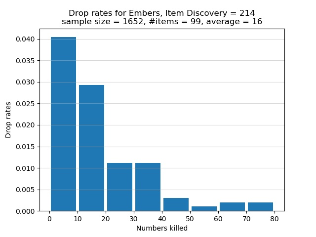

# Catacombs of Carthus

The Catacombs of Carthus is a dangerous area for farming Embers, primarily
because most of the large skeletons can trigger bleed with their weapons. A
number of skeletons have white eyes, meaning they must be killed twice. A
Blessed infused weapon is recommended because wielding such a weapon means you
only need to kill a white-eyed skeleton once. Unless you can 1-shot each enemy
or you also want to farm Vertebra Shackles, I suggest you farm Embers elsewhere.

Start from the Catacombs of Carthus bonfire and make your way to the 2 large
skeletons near the giant skeleton ball. Dispose of these 2 skeletons, but beware
they tend to stick together. A third white-eyed large skeleton is nearby; fight
it with a Blessed infused weapon if you want. Backtrack to the path of the
rolling giant skeleton ball, head down the stairs, and dispose of the nearby 4
rats. Leave the large rat alone; you don't need to kill it but make sure not to
trigger it. If you don't kill these 4 rats, they would creep up on you and gank
you to death while you are dealing with the shotel-wielding large skeleton at
the end of the hallway. After defeating the shotel-wielding skeleton, find the
path blocked by an illusory wall, walk up the staircase, always keeping to your
left so as not to trigger the nearby white-eyed large skeleton. If you walk up
the stairs (don't run) and keep to your left, the skeleton usually would leave
you alone, but sometimes it would be aggressive towards you. Dispose of this
skeleton as quickly as possible, while staying near the area around the
staircase you walked up. Moving too far away would also trigger another large
skeleton. Kill both skeletons, proceed to the end of the upstairs hallway, and
kill the large skeleton who wields a Long Bow. Descend the nearby staircase,
take the path where you would find a Crystal Lizard, go to the end of the path
to fight a large skeleton who stands near a cliff edge.

I now discuss the drop rates for Embers if you use the above route. The true
drop rate for Embers is 3% per large skeleton at the Catacombs of Carthus. With
214 Item Discovery, my chance of a drop is 6.42%. The experimental drop rates
are summarized in the histogram below. The horizontal axis shows how many large
skeletons must be killed, one after the other, in order for an Ember to spawn.
The vertical axis shows the chance of receiving an Ember after successively
killing a certain number of large skeletons. Note that each bar in the graph
lumps together 10 categories of kills. For example, the first bar represents the
cases where I had to kill 0, 1, 2, 3, 4, 5, 6, 7, 8, or 9 large skeletons in a
row to obtain an Ember. The second bar represents the cases where 10, 11, 12,
13, 14, 15, 16, 17, 18, or 19 large skeletons must be killed in succession to
get an Ember. Instead of having a separate bar for the category of 1 kill, or 2
kills, or 3 kills, etc., I lumped 10 categories of kills into one bar.

In total 1,652 large skeletons were defeated in order to obtain 99 Embers. On
average I killed approximately 16 large skeletons in succession for an Ember to
spawn. Of the large skeletons who were killed, approximately 6% of them dropped
Embers. This proportion is less than my chance of 6.42% of receiving a drop. The
graph shows that there is slightly over 4% chance to obtain an Ember after
killing between 1 and 9, inclusive, large skeletons in a row. This is the best
case scenario. The worst bad luck was the time I had to successively defeat 72
large skeletons to receive an Ember. As the graph shows, there is a chance of
less than 0.5% that I had to successively defeat between 70 and 79, inclusive,
large skeletons in order for an Ember to spawn.
