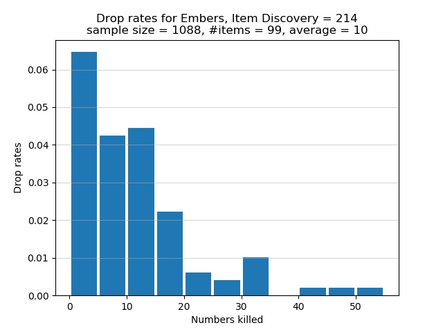

# Road of Sacrifices

By the time you reach this area, you should have picked up 5 Embers at the
Undead Settlement. You can pick up 2 Embers at the Road of Sacrifices. Some
enemies in this area drop Embers, but they can be difficult to fight unless you
know how to deal with them.

To farm Embers at the Road of Sacrifices, you can take either of 2 routes. The
first route is the more dangerous of the two and starts from the Road of
Sacrifices bonfire. From there make your way down the first inclined plane,
descend 2 cliffs, and fight a Lycanthrope sitting near a bunch of Poisonhorn
Bugs. Any Lycanthrope won't be hostile towards you unless you are directly in
its line of sight. If you approach it from its side and be constantly in its
peripheral vision, a Lycanthrope would remain sitting down, thus easily granting
you the first hit. A second Lycanthrope is found nearby behind a tree and next
to a lone Poisonhorn Bug. If you approach it while on dry land, it would be
aggressive towards you. If you approach it from within the swamp and be in its
peripheral vision, be careful not to trigger the nearby Great Crab who would
become aggressive and run towards you. After disposing of both Lycanthropes,
fight the nearby Black Knight. According to the table below, each Lycanthrope
has a true drop rate of 5% of dropping you an Ember after its defeat, whereas
the true drop rate of the lone Black Knight is 8%. The higher true drop rate of
the Black Knight makes the above an attractive route for farming Embers.
However, note that if you take this route you must be careful not to trigger the
nearby Great Crab. Furthermore, any Black Knight is usually very dangerous and
cannot be easily staggered without a great or ultra great sword.

https://docs.google.com/spreadsheets/d/1K4FwS61pLzfQPXAfTZxVMLmRdxohUMhaW5jbZXHG814/edit#gid=23676873

The second route is easier than the first and starts from the Crucifixion Woods
bonfire. From there, keep to the right cliff edge so as not to trigger the
nearby Starved Hound. Once you see 2 Lycanthrope Hunters walking away from the
bonfire in the direction of where you would find Hodrick's purple summon sign,
kill those 2 enemies. Proceed to kill 2 more Lycanthrope Hunters at the cliff
edge ahead: one is standing while the other is sitting. From this cliff edge,
you would find 2 Lycanthropes sitting near a bonfire. If you want, use bow and
arrows to grab the attention of the nearest Lycanthrope, lure it to the cliff
edge, and cheese it with bow and arrows. Use the same cheese tactic for the
second Lycanthrope. If you have a Raw infused Claymore+3, approach the nearest
Lycanthrope from the side so you would be in its peripheral vision, 2-hand your
weapon, and R1 spam the creature. Do the same to the other nearby Lycanthrope.
There is a third Lycanthrope located in the room where you would find the Sage
Ring+0. If you enter the room via the entrance in the swamp, the Lycanthrope
would be sitting waiting to ambush you. Before you enter the room, throw an
Alluring Skull somewhere into the room to attract the Lycanthrope's attention.
While the creature is distracted, kill it as quickly as possible. Without an
Alluring Skull you must fight the creature head on.

Using the Thief starting class, the following SL61 build can one-shot each
Lycanthrope:

```
20 Vigor
15 Attunement
15 Endurance
20 Vitality
 9 Strength
13 Dexterity
36 Intelligence
 8 Faith
14 Luck
```

I attuned the Soul Spear sorcery bought from Orbeck. I also equipped these
items: Scholar's Candlestick in the right hand, Court Sorcerer's Staff+10 in the
left hand for easy buffing, Scholar Ring, Young Dragon Ring, Bellowing
Dragoncrest Ring, Magic Clutch Ring. Prior to casting the Soul Spear sorcery, I
would buff the Court Sorcerer's Staff by using L2 and then cast the spell. The
buff on the staff grants some bonus damage output. The Scholar Ring adds an
extra 5 points to Intelligence, without which I wouldn't be able to 1-shot a
Lycanthrope. Finally, the Symbol of Avarice brings my Item Discovery to 214.
Apart from the mimic head, I didn't equip any pieces of armour to maintain my
weight ratio at less than 30%.

I now discuss the drop rates for Embers if you use the above second route. The
true drop rate for Embers is 5% per Lycanthrope at the Road of Sacrifices. With
214 Item Discovery, my chance of a drop is 10.7%. The experimental drop rates
are summarized in the histogram below. The horizontal axis shows how many
Lycanthropes must be killed, one after the other, in order for an Ember to
spawn. The vertical axis shows the chance of receiving an Ember after
successively killing a certain number of Lycanthropes. Note that each bar in the
graph lumps together 5 categories of kills. For example, the first bar
represents the cases where I had to kill 0, 1, 2, 3, or 4 Lycanthropes in a row
to obtain an Ember. The second bar represents the cases where 5, 6, 7, 8, or 9
Lycanthropes must be killed in succession to get an Ember. Instead of having a
separate bar for the category of 1 kill, or 2 kills, or 3 kills, etc., I lumped
5 categories of kills into one bar.



In total 1,088 Lycanthropes were defeated in order to obtain 99 Embers. On
average I killed approximately 10 Lycanthropes in succession for an Ember to
spawn. Of the Lycanthropes who were killed, about 9% of them dropped Embers.
This proportion is less than my chance of 10.7% of receiving a drop. The graph
shows that there is approximately 6.5% chance to obtain an Ember after killing
between 1 and 4, inclusive, Lycanthropes in a row. This is the best case
scenario. The worst bad luck was the time I had to successively defeat 52
Lycanthropes to receive an Ember. As the graph shows, there is a chance of less
than 0.5% that I had to successively defeat between 50 and 54, inclusive,
Lycanthropes in order for an Ember to spawn.
