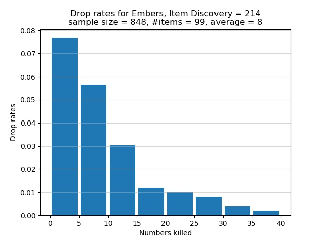

# Untended Graves

There are no Embers to pick up at the Untended Graves. Visit the dark Firelink
Shrine after the Champion Gundyr bonfire. The Shrine Handmaid sells 3 Embers for
2,500 souls each.

The 4 Black Knights near the dark Firelink Shrine are a good source of Embers.
Each knight by himself is very strong and has immense poise. To fight a Black
Knight, use a greatsword or ultra greatsword, buff your weapon with lightning,
get in one hit, and roll or move away. If possible, use a sorcery build capable
of 1-shotting a Black Knight. Alternatively, lure 1 or 2 Black Knights to the
main entrance of Firelink Shrine, proceed through the entrance, and the knights
wouldn't be able to enter. As a knight slowly retreats while blocking with his
shield, try to break his guard and riposte.

Using the Thief starting class, the following SL85 build can one-shot each Black
Knight:

```
20 Vigor
20 Attunement
20 Endurance
20 Vitality
 9 Strength
13 Dexterity
50 Intelligence
 8 Faith
14 Luck
```

I used the Great Soul Dregs sorcery found in The Dreg Heap. I also equipped
these items: Scholar's Candlestick in the right hand, Court Sorcerer's Staff+10
in the left hand for easy buffing, Scholar Ring, Young Dragon Ring, Bellowing
Dragoncrest Ring, Dark Clutch Ring. Prior to casting the Great Soul Dregs
sorcery, I would buff the Court Sorcerer's Staff by using L2 and then cast the
sorcery. The buff on the staff grants some bonus damage output. The Scholar Ring
adds an extra 5 points to Intelligence, without which I wouldn't be able to
1-shot a Black Knight. Finally, the Symbol of Avarice brings my Item Discovery
to 214. Apart from the mimic head, I didn't equip any pieces of armour to
maintain my weight ratio at less than 30%.

I now discuss the drop rates for Embers if you use the above route. According to
the table

https://docs.google.com/spreadsheets/d/1K4FwS61pLzfQPXAfTZxVMLmRdxohUMhaW5jbZXHG814/edit#gid=23676873

the true drop rate for Embers is 5% per Black Knight outside the dark Firelink
Shrine. With 214 Item Discovery, my chance of a drop is 10.7%. The experimental
drop rates are summarized in the histogram below. The horizontal axis shows how
many Black Knights must be killed, one after the other, in order for an Ember to
spawn. The vertical axis shows the chance of receiving an Ember after
successively killing a certain number of Black Knights. Note that each bar in
the graph lumps together 5 categories of kills. For example, the first bar
represents the cases where I had to kill 0, 1, 2, 3, or 4 Black Knights in a row
to obtain an Ember. The second bar represents the cases where 5, 6, 7, 8, or 9
Black Knights must be killed in succession to get an Ember. Instead of having a
separate bar for the category of 1 kill, or 2 kills, or 3 kills, etc., I lumped
5 categories of kills into one bar.



In total 848 Black Knights were defeated in order to obtain 99 Embers. On
average I killed approximately 8 Black Knights in succession for an Ember to
spawn. Of the Black Knights who were killed, about 11.7% of them dropped Embers.
This proportion is greater than my chance of 10.7% of receiving a drop. The
graph shows that there is over 7.5% chance to obtain an Ember after killing
between 1 and 4, inclusive, Black Knights in a row. This is the best case
scenario. The worst bad luck was the time I had to successively defeat 36 Black
Knights to receive an Ember. As the graph shows, there is a chance of less than
0.5% that I had to successively defeat between 35 and 39, inclusive, Black
Knights in order for an Ember to spawn.
